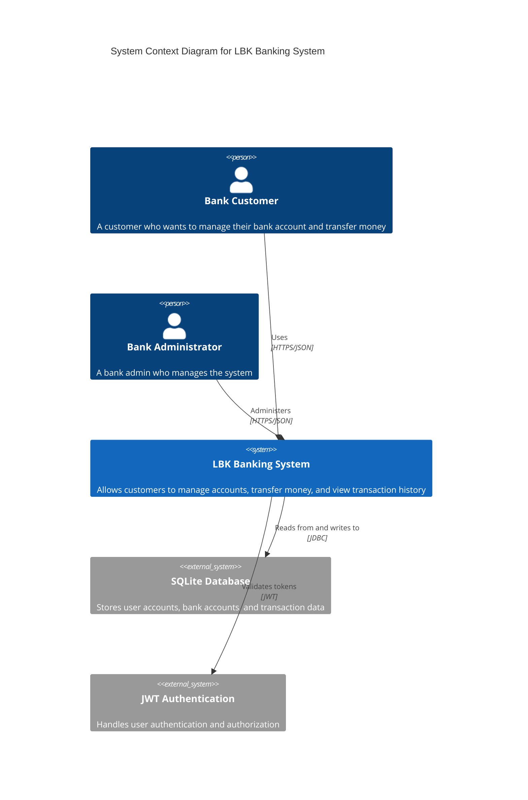
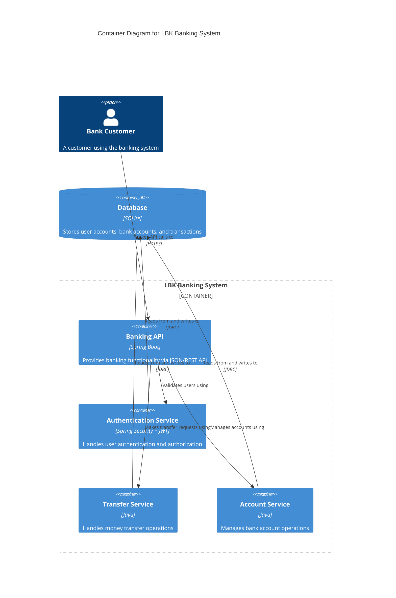
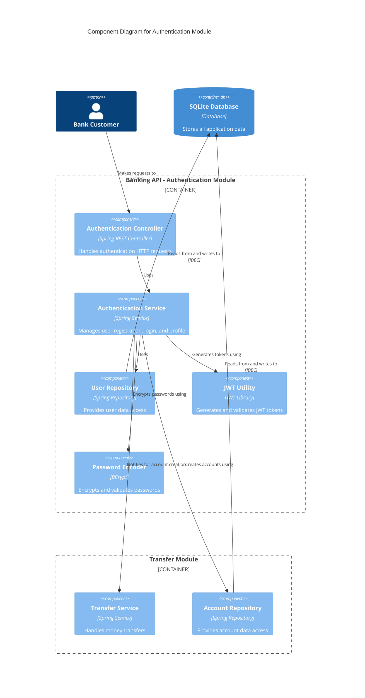
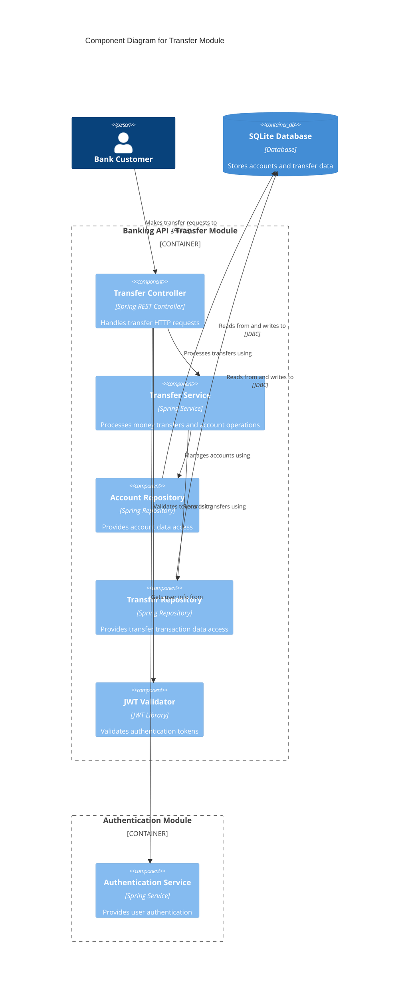

# C4 Architecture Diagram

This document contains the C4 architecture diagrams for the BE Project using Mermaid notation, showing the system architecture at different levels.

## System Context Diagram (Level 1)

## Container Diagram (Level 2)

## Component Diagram (Level 3) - Authentication Module

## Component Diagram (Level 3) - Transfer Module

## Architecture Overview

### System Components

**🏦 LBK Banking System**
- **Technology Stack**: Spring Boot 3.5.4, Java 21
- **Database**: SQLite with JDBC
- **Authentication**: JWT-based token authentication
- **API Style**: REST API with JSON

**📋 Core Modules:**

1. **Authentication Module**
   - User registration and login
   - JWT token generation and validation
   - Password encryption with BCrypt
   - Automatic bank account creation

2. **Transfer Module**
   - Money transfer between accounts
   - Account balance management
   - Transaction history tracking
   - Transfer validation and processing

3. **Account Module**
   - Bank account management
   - Balance inquiries
   - Account information updates
   - Membership level management

### Key Architectural Patterns

**🏗️ Layered Architecture:**
- **Controller Layer**: REST endpoints (`@RestController`)
- **Service Layer**: Business logic (`@Service`)
- **Repository Layer**: Data access (`@Repository`)
- **Model Layer**: Data entities and DTOs

**🔐 Security Architecture:**
- JWT-based stateless authentication
- Bearer token validation for protected endpoints
- Password encryption using BCrypt
- Request/Response validation

**💾 Data Architecture:**
- SQLite database with JDBC connectivity
- Auto-increment primary keys
- Foreign key relationships
- Transaction logging for audit trails

### Integration Points

**🔗 Inter-Module Communication:**
- Authentication service creates bank accounts automatically
- Transfer service validates user authentication
- All modules share the same database instance
- JWT tokens are validated across all protected endpoints

**📡 External Interfaces:**
- REST API endpoints for client applications
- Database JDBC connections
- JWT token validation service
- Password encryption service

This C4 architecture provides a comprehensive view of the LBK Banking System, showing how the different components interact and the overall system structure at multiple levels of detail.
