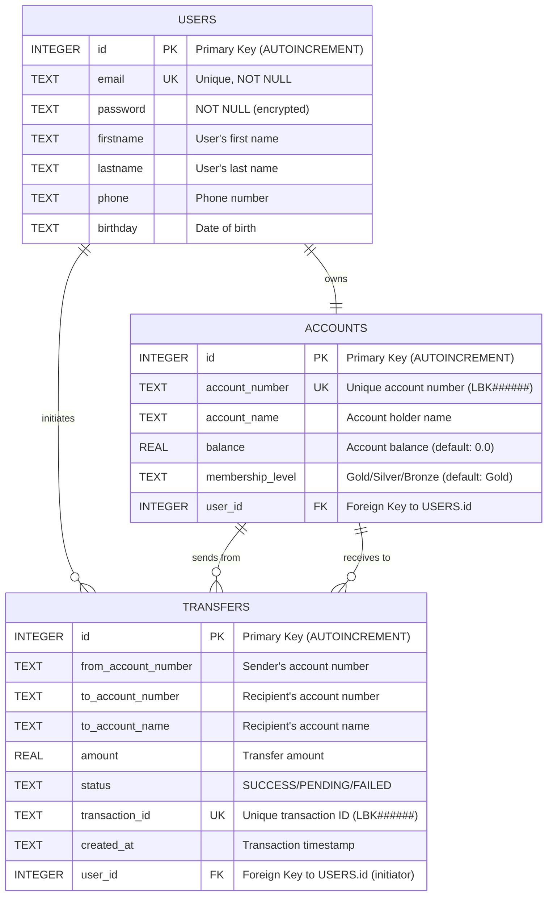

# Database Schema - ER Diagram

This document contains the Entity-Relationship diagram for the BE Project database schema using Mermaid notation.

## Entity Relationship Diagram

## Table Descriptions

### USERS Table
- **Primary Key**: `id` (Auto-increment integer)
- **Unique Constraints**: `email`
- **Purpose**: Stores user account information for authentication and profile management
- **Relationships**: 
  - One-to-One with ACCOUNTS (each user has exactly one bank account)
  - One-to-Many with TRANSFERS (users can initiate multiple transfers)

### ACCOUNTS Table
- **Primary Key**: `id` (Auto-increment integer)
- **Unique Constraints**: `account_number`
- **Foreign Keys**: `user_id` → USERS.id
- **Purpose**: Stores bank account information including balance and membership details
- **Default Values**: 
  - `balance`: 0.0
  - `membership_level`: 'Gold'
- **Account Number Format**: LBK######
- **Relationships**:
  - One-to-One with USERS (each account belongs to one user)
  - One-to-Many with TRANSFERS (accounts can send/receive multiple transfers)

### TRANSFERS Table
- **Primary Key**: `id` (Auto-increment integer)
- **Unique Constraints**: `transaction_id`
- **Foreign Keys**: `user_id` → USERS.id
- **Purpose**: Stores money transfer transaction records
- **Status Values**: SUCCESS, PENDING, FAILED
- **Transaction ID Format**: LBK######
- **Relationships**:
  - Many-to-One with USERS (multiple transfers can be initiated by one user)
  - Many-to-One with ACCOUNTS (multiple transfers can involve the same account)

## Business Rules

1. **User-Account Relationship**: Each user automatically gets one bank account upon registration
2. **Account Creation**: New accounts start with a default balance of 15,420.00 THB and Gold membership
3. **Transfer Validation**: Transfers require sufficient balance in the sender's account
4. **Transaction Tracking**: All transfers are logged with unique transaction IDs for audit purposes
5. **Account Numbers**: Auto-generated in format LBK + 6-digit user ID
6. **Transaction IDs**: Auto-generated in format LBK + 6-digit timestamp-based number

## Database Technology

- **Database Engine**: SQLite
- **Auto-increment**: Used for all primary keys
- **Constraints**: UNIQUE constraints on email, account_number, and transaction_id
- **Data Types**: 
  - INTEGER for IDs and foreign keys
  - TEXT for strings
  - REAL for monetary amounts and balances

## Notes

- All monetary amounts are stored as REAL (floating-point) values
- Timestamps are stored as TEXT in ISO format
- The database uses SQLite's built-in AUTOINCREMENT for primary keys
- Foreign key relationships are enforced at the application level
